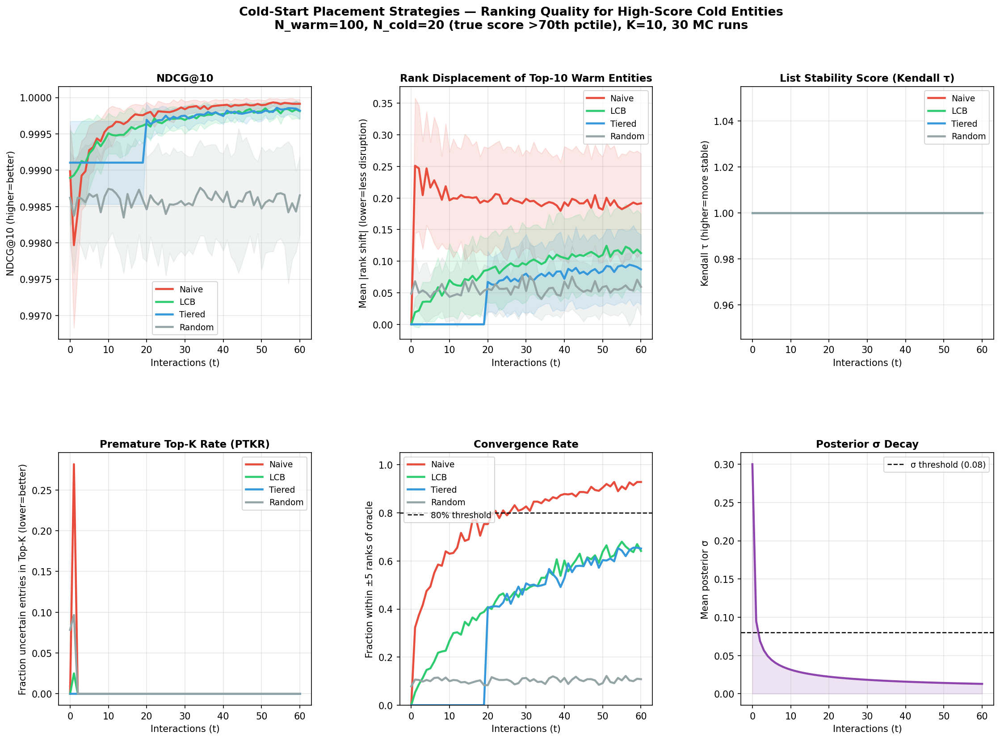
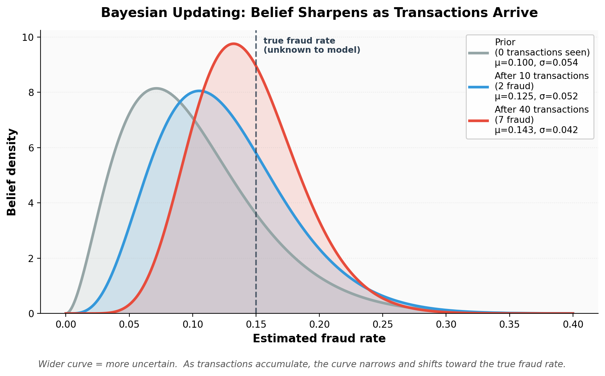

# Cold Start in Fraud Detection: Scoring vs. Ranking

*Code and experiments behind the article ["Scoring and Ranking Are Two Different Problems: Rethinking Cold Start in Fraud Detection."](#citation)*


---



## Table of Contents

- [Overview](#overview)
- [What's Here](#whats-here)
- [The Four Placement Strategies](#the-four-placement-strategies)
- [The Metric That Matters: PTKR](#the-metric-that-matters-premature-top-k-rate-ptkr)
- [Results](#results)
- [Setup](#setup)
- [Running the Synthetic Experiment](#running-the-synthetic-experiment)
- [Running the IEEE-CIS Experiment](#running-the-ieee-cis-real-data-experiment)
- [Generating the Bayesian-Updating Illustration](#generating-the-bayesian-updating-illustration)
- [Citation](#citation)
- [License](#license)
- [Disclaimer](#disclaimer)

## Overview

Scoring a new entity (a card with no transaction history) and deciding where it should sit in a ranked review queue are two different problems. A new card's *uncertainty* — not just its point-estimate fraud score — should determine its placement.

This repo implements and benchmarks four placement strategies under a Bayesian (Beta-Binomial) updating framework, on both a controlled synthetic dataset and the real-world IEEE-CIS Fraud Detection dataset.

## What's Here

```
src/
  cold_start_sim.py        synthetic experiment: 100 warm + 30 cold cards,
                            Beta(5,2)-distributed true rates, 60-step simulation
  ieee_experiment.py        real-data experiment on IEEE-CIS Fraud Detection
  plot_bayesian_update.py   generates the Beta-distribution illustration of
                            belief narrowing as transactions arrive
notebooks/
  notebook_simulation.ipynb    walkthrough of the synthetic experiment
  notebook_ieee_cis.ipynb      walkthrough of the IEEE-CIS experiment
figures/                   generated plots used in the article
results/                   CSV outputs (per-run and aggregated metrics)
```

## The Four Placement Strategies

| Strategy | Placement Rule | Behavior |
|---|---|---|
| **Naive** | Insert at the point estimate `mu` | No uncertainty adjustment — the status quo in most systems |
| **LCB** (Lower Confidence Bound) | Insert at `mu - k·sigma` | Higher uncertainty → lower initial placement; rises as sigma shrinks with evidence |
| **Tiered** | Fixed holding band for an initial window, then LCB | Routes new cards to a safe zone before releasing them into uncertainty-aware placement |
| **Random** | Uniformly random insertion | Baseline control |

## The Metric That Matters: Premature Top-K Rate (PTKR)

Standard ranking metrics like NDCG are blind to *who* caused disruption in a review queue. PTKR flags a placement as premature only when all three hold:

1. the card is in the top-K,
2. the model is still highly uncertain about it (`sigma` above a threshold), and
3. its true (oracle) position is outside the top-K.

## Results

### Synthetic experiment (`cold_start_sim.py`, K=10, 60 steps, 30 cold cards)

| Strategy | NDCG@10 (t=0) | NDCG@10 (t=60) | PTKR peak | 80% Convergence |
|---|---|---|---|---|
| Naive | 0.999 | 0.9999 | **28.2%** | step 22 |
| LCB | 0.999 | 0.9998 | **2.5%** | >60 |
| Tiered | 0.999 | 0.9998 | **0.0%** | >60 |
| Random | 0.999 | 0.9987 | 9.7% | >60 |

### IEEE-CIS real-data experiment (`ieee_experiment.py`, K=20, 20 steps, 60 cold cards)

| Strategy | NDCG@20 (t=0) | NDCG@20 (t=20) | PTKR peak | 80% Convergence |
|---|---|---|---|---|
| Naive | 0.9916 | 0.9994 | 0.17% | >20 |
| LCB | 0.9929 | 0.9984 | 0.0% | step 0 |
| Tiered | 0.9921 | 0.9982 | 0.0% | step 8 |
| Random | 0.9898 | 0.9896 | 0.17% | >20 |

Naive placement peaks at 28.2% PTKR on the synthetic data; LCB and Tiered reduce this to 0–3% at negligible cost to NDCG. The IEEE-CIS run confirms the same direction on real, noisier data: LCB and Tiered converge to the oracle ranking almost immediately, while Naive and Random stay unconverged through the full 20-step window.

## Setup

```bash
pip install -r requirements.txt
```

## Running the Synthetic Experiment

```bash
python src/cold_start_sim.py
```

Outputs land in `results/` and `figures/`.

## Running the IEEE-CIS (Real Data) Experiment

This experiment uses the [IEEE-CIS Fraud Detection dataset](https://www.kaggle.com/competitions/ieee-fraud-detection), released by Vesta Corporation for the 2019 Kaggle competition. The raw data is **not included in this repo** — review the dataset's Kaggle competition rules before downloading and reusing it.

1. Download `train_transaction.csv` from Kaggle.
2. Place it at `data/train_transaction.csv` (relative to the repo root), or point to it directly:

   ```bash
   export IEEE_CSV_PATH=/path/to/train_transaction.csv
   python src/ieee_experiment.py
   ```

## Generating the Bayesian-Updating Illustration

```bash
python src/plot_bayesian_update.py
```



## Citation

If you reference this work, please link back to the original article, *"Scoring and Ranking Are Two Different Problems: Rethinking Cold Start in Fraud Detection."*

## License

MIT — see [LICENSE](LICENSE).

## Disclaimer

The author has no affiliation with Kaggle or Vesta Corporation. The IEEE-CIS dataset is subject to its own competition terms; this repo only provides code, not the data itself.
